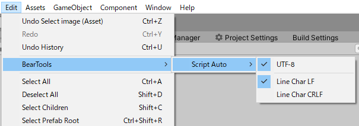
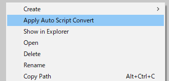
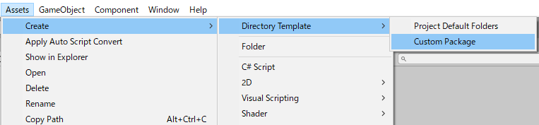
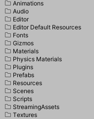
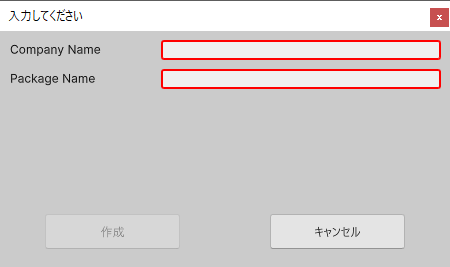
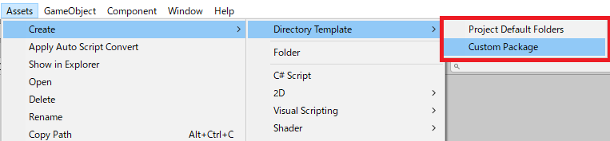
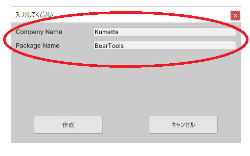

# エディタツールについて


# 要件
- Unity 2019.4+

<br>

# 機能

## 文字コード、改行コードの変換
> **NOTE** 文字コード変換は、 **Shift-JIS ⇒ UTF-8** のみサポート（Windows）

<br>

### 自動変換設定
- **[ Create -> C# Script ]** で、スクリプトを作成した場合、自動変換
- **[Edit -> BearTools -> Script Auto]** のメニューから、オン・オフを設定

    

<br>

### スクリプトまたは、ディレクトリ配下を変換
- 任意のスクリプト、ディレクトリを、**[Project]** ウィンドウで選択、右クリックメニューから **[Apply Auto Script Convert]**

- ディレクトリを選択した場合、サブディレクトリを含む、すべてのスクリプトを変換

    

<br>
<br>

## ディレクトリレイアウトの作成

<br>

### プロジェクトの標準フォルダ作成
- 任意のディレクトリを、**[Project]** ウィンドウで選択、<br>
右クリックメニューから **[Create -> Directory Template -> Project Default Folders]**

    


    <table><tr><td>

    | フォルダ名 |
    | ---- |
    | Animations |
    | Audio |
    | Editor |
    | Editor Default Resources |
    | Fonts |
    | Gizmos |
    | Materials |
    | Physics Materials |
    | Plugins |
    | Prefabs |
    | Resources |
    | Scenes |
    | Scripts |
    | StreamingAssets |
    | Textures | 


    </td><td>

    

    </td></tr></table>

<br>

### カスタムパッケージのパッケージレイアウトを作成


- 任意のディレクトリを、**[Project]** ウィンドウで選択、<br>
右クリックメニューから **[Create -> Directory Template -> Custom Package]**

    [Unityマニュアル　パッケージレイアウト](https://docs.unity3d.com/ja/current/Manual/cus-layout.html)
    


    
    
    

<br>
<br>

### ユーザー定義のディレクトリレイアウトの作成
> **NOTE** パッケージ配下の **[Editor/Resources/DirectoryDefinitionFile/Default-DirectoryDefinition.json]** を、参照すると分かりやすいと思います

- **[Asetts]** 配下の任意の場所に、"○○-**DirectoryDefinition.json**"の形式でファイルを作成

<br>

#### **JSON定義**

- **ルート定義**
    | 項目名 | 説明 |
    | --- | --- |
    | name | [ Create -> Directory Template -> **name** ] に表示される名称 |
    | root-directory | ・ "**[Current-Directory]**" を、指定した場合、**[Project]** ウィンドウで選択したディレクトリ<br>・ 未指定の場合、**Assets** 直下<br>・ 指定した場合、**Assets** 配下からの相対パス |
    | replace-input | **置換文字列定義** の配列 |
    | directory-definition | **ディレクトリ定義** の配列 |

    


<br>

- **置換文字列定義** <br>置換用の入力項目を作成
    | 項目名 | 説明 |
    | --- | --- |
    | label | 入力時のラベル |
    | input-type | ・Free<br>・Number<br>・Alphabet<br>・AlphabetOrNumber<br>・Regex　[C#の正規表現に従う](https://docs.microsoft.com/ja-jp/dotnet/standard/base-types/regular-expressions) |
    | replace-string | 置換元の文字列 <br> **ディレクトリ定義** の **"name"** 、ファイル内の **[replace-string]** 形式の<br>"[]"で囲った文字列が置き換えられる<br> また、 **[replace-string:TopUpper]** の形式で、下記を設定できる <br>・ **TopUpper** (先頭大文字) <br>・ **Upper** (すべて大文字)  <br>・ **Lower** (すべて小文字)  |
    | regex-pattern | 正規表現のパターン（ **input-type** が **Regex** 以外の場合、無視） |
    | defalut | デフォルト値 |
    | required | true, false |

    

<br>

- **ディレクトリ定義**
    | 項目名 | 説明 |
    | --- | --- |
    | type | ・Directory<br>・Text<br>・Json<br>・Markdown<br>・Asmdef<br>・Binary |
    | name | 作成時のファイル名称 |
    | tmpPath | テンプレートファイルの、**Assets** からの相対パス |
    | children | **type**に **Directory** を指定した場合、配下を **ディレクトリ定義** の配列で定義 |

<br>

**JSONサンプル**
```json
[
    {
        "name": "Ny Directory",
        "root-directory": "[Current-Directory]",
        "replace-input": [
            {
                "label": "Input Value",
                "input-type": "AlphabetOrNumber",
                "replace-string": "input-value",
                "defalut": "",
                "required": true
            }
        ],
        "directory-definition": [
            {
                "type": "directory",
                "name": "[input-value]",
                "children": [
                    {
                        "type": "json",
                        "name": "my-[input-value:Lower].json",
                        "tmpPath": "Editor/Template/mytemp.json.template"
                    },
                    {
                        "type": "directory",
                        "name": "HugaHuga",
                        "children": [
                            {
                                "type": "Text",
                                "name": "My.[input-value:TopUpper].txt"
                            }
                        ]
                    }
                ]
            }
        ]
    }
]
```
